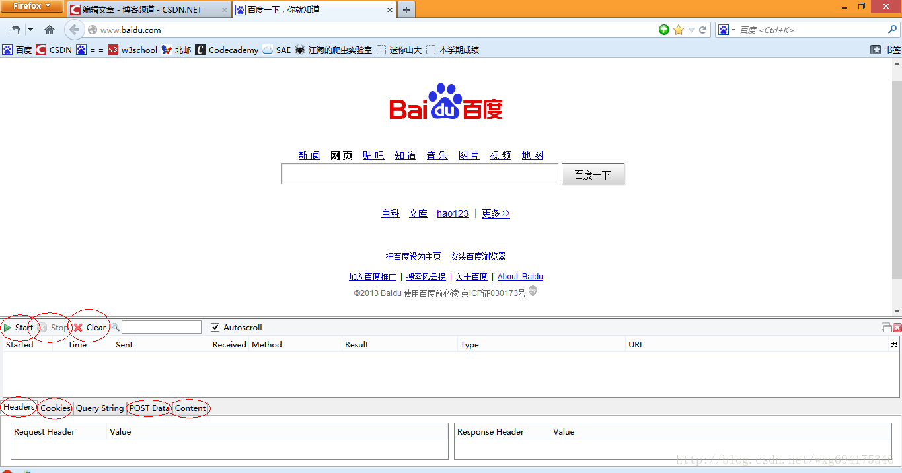
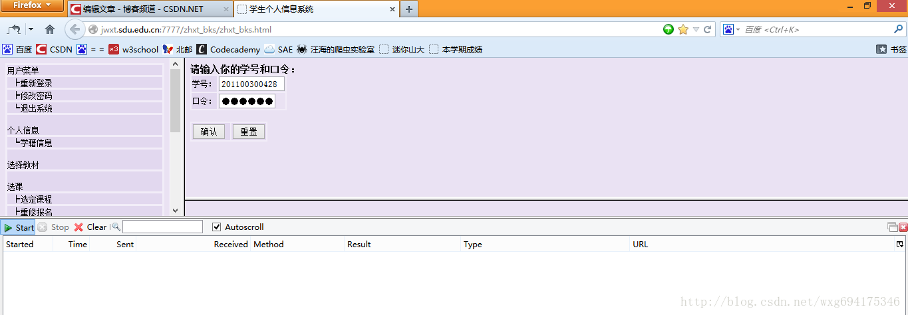
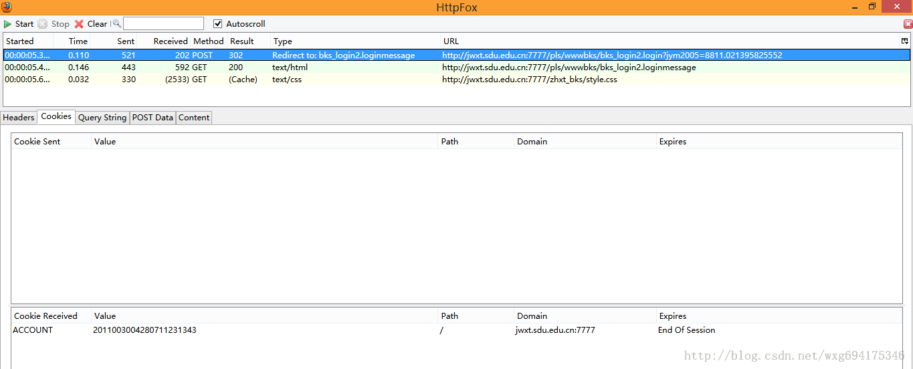
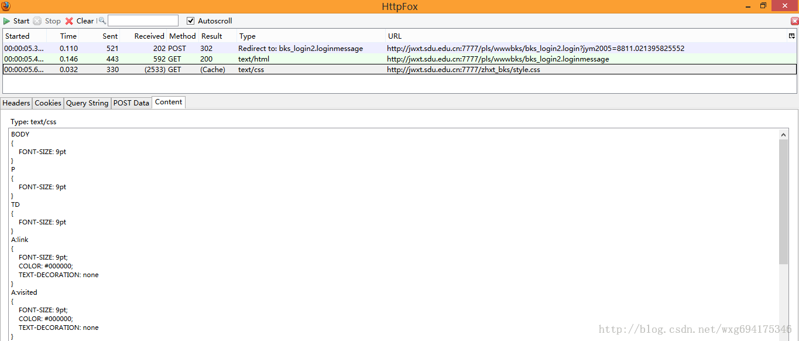
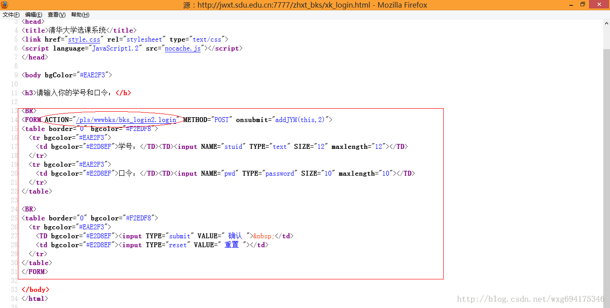
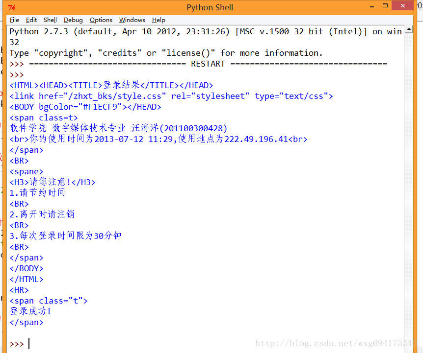
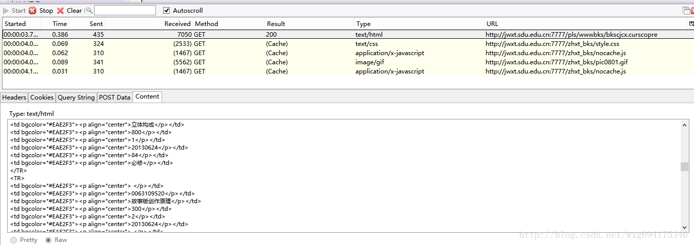
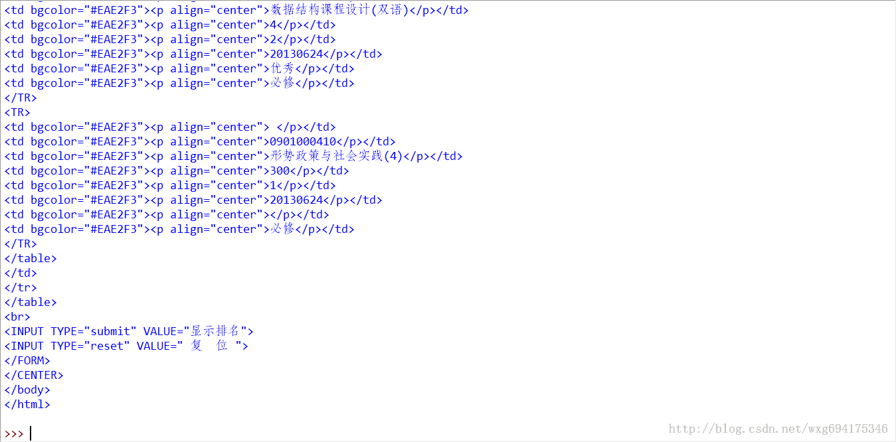
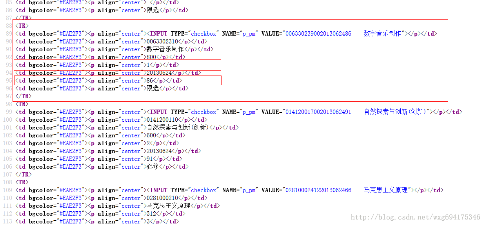
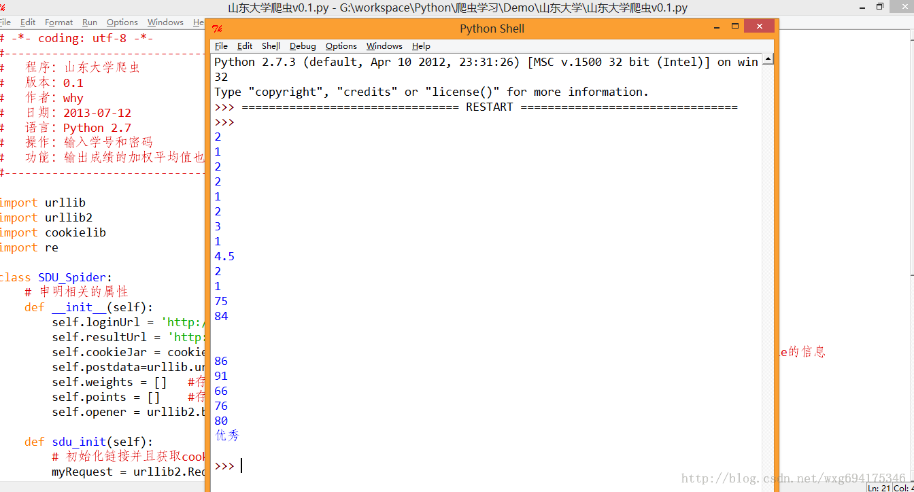

# 一个爬虫的诞生全过程（以山东大学绩点运算为例）

先来说一下我们学校的网站：

[http://jwxt.sdu.edu.cn:7777/zhxt_bks/zhxt_bks.html](http://jwxt.sdu.edu.cn:7777/zhxt_bks/zhxt_bks.html)

查询成绩需要登录，然后显示各学科成绩，但是只显示成绩而没有绩点，也就是加权平均分。


显然这样手动计算绩点是一件非常麻烦的事情。所以我们可以用python做一个爬虫来解决这个问题。

## 1.决战前夜

先来准备一下工具：HttpFox 插件。
这是一款 http 协议分析插件，分析页面请求和响应的时间、内容、以及浏览器用到的 COOKIE 等。
以我为例，安装在火狐上即可，效果如图：



可以非常直观的查看相应的信息。
点击 start 是开始检测，点击 stop 暂停检测，点击 clear 清除内容。
一般在使用之前，点击 stop 暂停，然后点击 clear 清屏，确保看到的是访问当前页面获得的数据。


## 2.深入敌后

下面就去山东大学的成绩查询网站，看一看在登录的时候，到底发送了那些信息。
先来到登录页面，把 httpfox 打开，clear 之后，点击 start 开启检测：



输入完了个人信息，确保 httpfox 处于开启状态，然后点击确定提交信息，实现登录。
这个时候可以看到，httpfox 检测到了三条信息：


这时点击 stop 键，确保捕获到的是访问该页面之后反馈的数据，以便我们做爬虫的时候模拟登陆使用。

## 3.庖丁解牛

乍一看我们拿到了三个数据，两个是 GET 的一个是 POST 的，但是它们到底是什么，应该怎么用，我们还一无所知。
所以，我们需要挨个查看一下捕获到的内容。
先看 POST 的信息：


既然是 POST 的信息，我们就直接看 PostData 即可。
可以看到一共 POST 两个数据，stuid 和 pwd。
并且从 Type 的 Redirect to 可以看出，POST 完毕之后跳转到了 bks_login2.loginmessage 页面。
由此看出，这个数据是点击确定之后提交的表单数据。
点击 cookie 标签，看看 cookie 信息：



没错，收到了一个 ACCOUNT 的 cookie，并且在 session 结束之后自动销毁。
那么提交之后收到了哪些信息呢？
我们来看看后面的两个 GET 数据。
先看第一个，我们点击 content 标签可以查看收到的内容，是不是有一种生吞活剥的快感-。-HTML 源码暴露无疑了：


看来这个只是显示页面的 html 源码而已，点击 cookie，查看 cookie 的相关信息：


啊哈，原来 html 页面的内容是发送了 cookie 信息之后才接受到的。
再来看看最后一个接收到的信息：



大致看了一下应该只是一个叫做 style.css 的 css文件，对我们没有太大的作用。

## 4.冷静应战

既然已经知道了我们向服务器发送了什么数据，也知道了我们接收到了什么数据，基本的流程如下：


- 首先，我们POST学号和密码--->然后返回cookie的值
- 然后发送cookie给服务器--->返回页面信息。
- 获取到成绩页面的数据，用正则表达式将成绩和学分单独取出并计算加权平均数。

OK，看上去好像很简单的样纸。那下面我们就来试试看吧。
但是在实验之前，还有一个问题没有解决，就是 POST 的数据到底发送到了哪里？
再来看一下当初的页面：


]
很明显是用一个 html 框架来实现的，也就是说，我们在地址栏看到的地址并不是右边提交表单的地址。
那么怎样才能获得真正的地址。右击查看页面源代码：
嗯没错，那个 name="w\_right"的就是我们要的登录页面。
网站的原来的地址是：  
http://jwxt.sdu.edu.cn:7777/zhxt_bks/zhxt_bks.html  
所以，真正的表单提交的地址应该是：  
http://jwxt.sdu.edu.cn:7777/zhxt_bks/xk_login.html  
输入一看，果不其然：


居然是清华大学的选课系统。。。目测是我校懒得做页面了就直接借了。。结果连标题都不改一下。。。
但是这个页面依旧不是我们需要的页面，因为我们的 POST 数据提交到的页面，应该是表单 form 的 ACTION 中提交到的页面。
也就是说，我们需要查看源码，来知道 POST 数据到底发送到了哪里：



嗯，目测这个才是提交 POST 数据的地址。

整理到地址栏中，完整的地址应该如下：  
http://jwxt.sdu.edu.cn:7777/pls/wwwbks/bks_login2.login  
（获取的方式很简单，在火狐浏览器中直接点击那个链接就能看到这个链接的地址了）

## 5.小试牛刀

接下来的任务就是：用 python 模拟发送一个 POST 的数据并取到返回的 cookie 值。  
关于 cookie 的操作可以看看这篇博文：  
[http://blog.csdn.net/wxg694175346/article/details/8925978](http://blog.csdn.net/wxg694175346/article/details/8925978)  
我们先准备一个 POST 的数据，再准备一个 cookie 的接收，然后写出源码如下：

```
# -*- coding: utf-8 -*-  
#---------------------------------------  
#   程序：山东大学爬虫  
#   版本：0.1  
#   作者：why  
#   日期：2013-07-12  
#   语言：Python 2.7  
#   操作：输入学号和密码  
#   功能：输出成绩的加权平均值也就是绩点  
#---------------------------------------  
  
import urllib    
import urllib2  
import cookielib  
  
cookie = cookielib.CookieJar()    
opener = urllib2.build_opener(urllib2.HTTPCookieProcessor(cookie))  
  
#需要POST的数据#  
postdata=urllib.urlencode({    
    'stuid':'201100300428',    
    'pwd':'921030'    
})  
  
#自定义一个请求#  
req = urllib2.Request(    
    url = 'http://jwxt.sdu.edu.cn:7777/pls/wwwbks/bks_login2.login',    
    data = postdata  
)  
  
#访问该链接#  
result = opener.open(req)  
  
#打印返回的内容#  
print result.read()     
```

如此这般之后，再看看运行的效果：



ok，如此这般，我们就算模拟登陆成功了。

## 6.偷天换日

接下来的任务就是用爬虫获取到学生的成绩。
再来看看源网站。
开启 HTTPFOX 之后，点击查看成绩，发现捕获到了如下的数据：



点击第一个 GET 的数据，查看内容可以发现 Content 就是获取到的成绩的内容。

而获取到的页面链接，从页面源代码中右击查看元素，可以看到点击链接之后跳转的页面（火狐浏览器只需要右击，“查看此框架”，即可）：


从而可以得到查看成绩的链接如下：  
[http://jwxt.sdu.edu.cn:7777/pls/wwwbks/bkscjcx.curscopre](http://jwxt.sdu.edu.cn:7777/pls/wwwbks/bkscjcx.curscopre)

## 7.万事俱备

现在万事俱备啦，所以只需要把链接应用到爬虫里面，看看能否查看到成绩的页面。
从 httpfox 可以看到，我们发送了一个 cookie 才能返回成绩的信息，所以我们就用 python 模拟一个 cookie 的发送，以此来请求成绩的信息：

```
# -*- coding: utf-8 -*-  
#---------------------------------------  
#   程序：山东大学爬虫  
#   版本：0.1  
#   作者：why  
#   日期：2013-07-12  
#   语言：Python 2.7  
#   操作：输入学号和密码  
#   功能：输出成绩的加权平均值也就是绩点  
#---------------------------------------  
  
import urllib    
import urllib2  
import cookielib  
  
#初始化一个CookieJar来处理Cookie的信息#  
cookie = cookielib.CookieJar()  
  
#创建一个新的opener来使用我们的CookieJar#  
opener = urllib2.build_opener(urllib2.HTTPCookieProcessor(cookie))  
  
#需要POST的数据#  
postdata=urllib.urlencode({    
    'stuid':'201100300428',    
    'pwd':'921030'    
})  
  
#自定义一个请求#  
req = urllib2.Request(    
    url = 'http://jwxt.sdu.edu.cn:7777/pls/wwwbks/bks_login2.login',    
    data = postdata  
)  
  
#访问该链接#  
result = opener.open(req)  
  
#打印返回的内容#  
print result.read()  
  
#打印cookie的值  
for item in cookie:    
    print 'Cookie：Name = '+item.name    
    print 'Cookie：Value = '+item.value  
  
      
#访问该链接#  
result = opener.open('http://jwxt.sdu.edu.cn:7777/pls/wwwbks/bkscjcx.curscopre')  
  
#打印返回的内容#  
print result.read()  
```

按下 F5 运行即可，看看捕获到的数据吧：



既然这样就没有什么问题了吧，用正则表达式将数据稍稍处理一下，取出学分和相应的分数就可以了。

## 8.手到擒来

这么一大堆 html 源码显然是不利于我们处理的，下面要用正则表达式来抠出必须的数据。  
关于正则表达式的教程可以看看这个博文：  
http://blog.csdn.net/wxg694175346/article/details/8929576

我们来看看成绩的源码：



既然如此，用正则表达式就易如反掌了。

我们将代码稍稍整理一下，然后用正则来取出数据：

```
# -*- coding: utf-8 -*-  
#---------------------------------------  
#   程序：山东大学爬虫  
#   版本：0.1  
#   作者：why  
#   日期：2013-07-12  
#   语言：Python 2.7  
#   操作：输入学号和密码  
#   功能：输出成绩的加权平均值也就是绩点  
#---------------------------------------  
  
import urllib    
import urllib2  
import cookielib  
import re  
  
class SDU_Spider:    
    # 申明相关的属性    
    def __init__(self):      
        self.loginUrl = 'http://jwxt.sdu.edu.cn:7777/pls/wwwbks/bks_login2.login'   # 登录的url  
        self.resultUrl = 'http://jwxt.sdu.edu.cn:7777/pls/wwwbks/bkscjcx.curscopre' # 显示成绩的url  
        self.cookieJar = cookielib.CookieJar()                                      # 初始化一个CookieJar来处理Cookie的信息  
        self.postdata=urllib.urlencode({'stuid':'201100300428','pwd':'921030'})     # POST的数据  
        self.weights = []   #存储权重，也就是学分  
        self.points = []    #存储分数，也就是成绩  
        self.opener = urllib2.build_opener(urllib2.HTTPCookieProcessor(self.cookieJar))  
  
    def sdu_init(self):  
        # 初始化链接并且获取cookie  
        myRequest = urllib2.Request(url = self.loginUrl,data = self.postdata)   # 自定义一个请求  
        result = self.opener.open(myRequest)            # 访问登录页面，获取到必须的cookie的值  
        result = self.opener.open(self.resultUrl)       # 访问成绩页面，获得成绩的数据  
        # 打印返回的内容  
        # print result.read()  
        self.deal_data(result.read().decode('gbk'))  
        self.print_data(self.weights);  
        self.print_data(self.points);  
  
    # 将内容从页面代码中抠出来    
    def deal_data(self,myPage):    
        myItems = re.findall('<TR>.*?<p.*?<p.*?<p.*?<p.*?<p.*?>(.*?)</p>.*?<p.*?<p.*?>(.*?)</p>.*?</TR>',myPage,re.S)     #获取到学分  
        for item in myItems:  
            self.weights.append(item[0].encode('gbk'))  
            self.points.append(item[1].encode('gbk'))  
  
              
    # 将内容从页面代码中抠出来  
    def print_data(self,items):    
        for item in items:    
            print item  
              
#调用    
mySpider = SDU_Spider()    
mySpider.sdu_init()    
```

水平有限，正则是有点丑。运行的效果如图：



ok，接下来的只是数据的处理问题了。。


## 9.凯旋而归

完整的代码如下，至此一个完整的爬虫项目便完工了。

```
# -*- coding: utf-8 -*-  
#---------------------------------------  
#   程序：山东大学爬虫  
#   版本：0.1  
#   作者：why  
#   日期：2013-07-12  
#   语言：Python 2.7  
#   操作：输入学号和密码  
#   功能：输出成绩的加权平均值也就是绩点  
#---------------------------------------  
  
import urllib    
import urllib2  
import cookielib  
import re  
import string  
  
  
class SDU_Spider:    
    # 申明相关的属性    
    def __init__(self):      
        self.loginUrl = 'http://jwxt.sdu.edu.cn:7777/pls/wwwbks/bks_login2.login'   # 登录的url  
        self.resultUrl = 'http://jwxt.sdu.edu.cn:7777/pls/wwwbks/bkscjcx.curscopre' # 显示成绩的url  
        self.cookieJar = cookielib.CookieJar()                                      # 初始化一个CookieJar来处理Cookie的信息  
        self.postdata=urllib.urlencode({'stuid':'201100300428','pwd':'921030'})     # POST的数据  
        self.weights = []   #存储权重，也就是学分  
        self.points = []    #存储分数，也就是成绩  
        self.opener = urllib2.build_opener(urllib2.HTTPCookieProcessor(self.cookieJar))  
  
    def sdu_init(self):  
        # 初始化链接并且获取cookie  
        myRequest = urllib2.Request(url = self.loginUrl,data = self.postdata)   # 自定义一个请求  
        result = self.opener.open(myRequest)            # 访问登录页面，获取到必须的cookie的值  
        result = self.opener.open(self.resultUrl)       # 访问成绩页面，获得成绩的数据  
        # 打印返回的内容  
        # print result.read()  
        self.deal_data(result.read().decode('gbk'))  
        self.calculate_date();  
  
    # 将内容从页面代码中抠出来    
    def deal_data(self,myPage):    
        myItems = re.findall('<TR>.*?<p.*?<p.*?<p.*?<p.*?<p.*?>(.*?)</p>.*?<p.*?<p.*?>(.*?)</p>.*?</TR>',myPage,re.S)     #获取到学分  
        for item in myItems:  
            self.weights.append(item[0].encode('gbk'))  
            self.points.append(item[1].encode('gbk'))  
  
    #计算绩点，如果成绩还没出来，或者成绩是优秀良好，就不运算该成绩  
    def calculate_date(self):  
        point = 0.0  
        weight = 0.0  
        for i in range(len(self.points)):  
            if(self.points[i].isdigit()):  
                point += string.atof(self.points[i])*string.atof(self.weights[i])  
                weight += string.atof(self.weights[i])  
        print point/weight  
  
              
#调用    
mySpider = SDU_Spider()    
mySpider.sdu_init()    
```