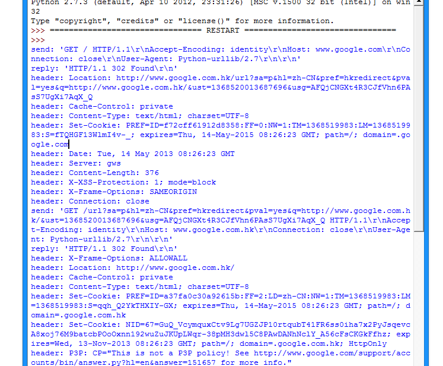

# urllib2 的使用细节与抓站技巧

前面说到了 urllib2 的简单入门，下面整理了一部分 urllib2 的使用细节。

## 1.Proxy 的设置

urllib2 默认会使用环境变量 http_proxy 来设置 HTTP Proxy。
如果想在程序中明确控制 Proxy 而不受环境变量的影响，可以使用代理。

新建 test14 来实现一个简单的代理 Demo：

```
import urllib2  
enable_proxy = True  
proxy_handler = urllib2.ProxyHandler({"http" : 'http://some-proxy.com:8080'})  
null_proxy_handler = urllib2.ProxyHandler({})  
if enable_proxy:  
    opener = urllib2.build_opener(proxy_handler)  
else:  
    opener = urllib2.build_opener(null_proxy_handler)  
urllib2.install_opener(opener)  
```

这里要注意的一个细节，使用 urllib2.install_opener() 会设置 urllib2 的全局 opener 。
这样后面的使用会很方便，但不能做更细致的控制，比如想在程序中使用两个不同的 Proxy 设置等。
比较好的做法是不使用 install_opener 去更改全局的设置，而只是直接调用 opener 的 open 方法代替全局的 urlopen 方法。

## 2.Timeout 设置

在老版 Python 中（Python2.6前），urllib2 的 API 并没有暴露 Timeout 的设置，要设置 Timeout 值，只能更改 Socket 的全局 Timeout 值。

```
import urllib2  
import socket  
socket.setdefaulttimeout(10) # 10 秒钟后超时  
urllib2.socket.setdefaulttimeout(10) # 另一种方式  
```

在 Python 2.6 以后，超时可以通过 urllib2.urlopen() 的 timeout 参数直接设置。

```
import urllib2  
response = urllib2.urlopen('http://www.google.com', timeout=10)  
```

## 3.在 HTTP Request 中加入特定的 Header

要加入 header，需要使用 Request 对象：

```
import urllib2  
request = urllib2.Request('http://www.baidu.com/')  
request.add_header('User-Agent', 'fake-client')  
response = urllib2.urlopen(request)  
print response.read()  
```

对有些 header 要特别留意，服务器会针对这些 header 做检查  


- User-Agent : 有些服务器或 Proxy 会通过该值来判断是否是浏览器发出的请求  
- Content-Type : 在使用 REST 接口时，服务器会检查该值，用来确定 HTTP Body 中的内容该怎样解析。常见的取值有：  
- application/xml ： 在 XML RPC，如 RESTful/SOAP 调用时使用
- application/json ： 在 JSON RPC 调用时使用  
- application/x-www-form-urlencoded ： 浏览器提交 Web 表单时使用  

在使用服务器提供的 RESTful 或 SOAP 服务时， Content-Type 设置错误会导致服务器拒绝服务

## 4.Redirect

urllib2 默认情况下会针对 HTTP 3XX 返回码自动进行 redirect 动作，无需人工配置。要检测是否发生了 redirect 动作，只要检查一下 Response 的 URL 和 Request 的 URL 是否一致就可以了。

```
import urllib2  
my_url = 'http://www.google.cn'  
response = urllib2.urlopen(my_url)  
redirected = response.geturl() == my_url  
print redirected  
  
my_url = 'http://rrurl.cn/b1UZuP'  
response = urllib2.urlopen(my_url)  
redirected = response.geturl() == my_url  
print redirected  
```

如果不想自动 redirect，除了使用更低层次的 httplib 库之外，还可以自定义HTTPRedirectHandler 类。

```
import urllib2  
class RedirectHandler(urllib2.HTTPRedirectHandler):  
    def http_error_301(self, req, fp, code, msg, headers):  
        print "301"  
        pass  
    def http_error_302(self, req, fp, code, msg, headers):  
        print "303"  
        pass  
  
opener = urllib2.build_opener(RedirectHandler)  
opener.open('http://rrurl.cn/b1UZuP')  
```

## 5.Cookie

urllib2 对 Cookie 的处理也是自动的。如果需要得到某个 Cookie 项的值，可以这么做：

```
import urllib2  
import cookielib  
cookie = cookielib.CookieJar()  
opener = urllib2.build_opener(urllib2.HTTPCookieProcessor(cookie))  
response = opener.open('http://www.baidu.com')  
for item in cookie:  
    print 'Name = '+item.name  
    print 'Value = '+item.value  
```

运行之后就会输出访问百度的 Cookie 值：


## 6.使用 HTTP 的 PUT 和 DELETE 方法

urllib2 只支持 HTTP 的 GET 和 POST 方法，如果要使用 HTTP PUT 和 DELETE ，只能使用比较低层的 httplib 库。虽然如此，我们还是能通过下面的方式，使 urllib2 能够发出 PUT 或DELETE 的请求：

```
import urllib2  
request = urllib2.Request(uri, data=data)  
request.get_method = lambda: 'PUT' # or 'DELETE'  
response = urllib2.urlopen(request)  
```

## 7.得到 HTTP 的返回码

对于 200 OK 来说，只要使用 urlopen 返回的 response 对象的 getcode() 方法就可以得到 HTTP 的返回码。但对其它返回码来说，urlopen 会抛出异常。这时候，就要检查异常对象的 code 属性了：

```
import urllib2  
try:  
    response = urllib2.urlopen('http://bbs.csdn.net/why')  
except urllib2.HTTPError, e:  
    print e.code  
```

## 8.Debug Log

使用 urllib2 时，可以通过下面的方法把 debug Log 打开，这样收发包的内容就会在屏幕上打印出来，方便调试，有时可以省去抓包的工作

```
import urllib2  
httpHandler = urllib2.HTTPHandler(debuglevel=1)  
httpsHandler = urllib2.HTTPSHandler(debuglevel=1)  
opener = urllib2.build_opener(httpHandler, httpsHandler)  
urllib2.install_opener(opener)  
response = urllib2.urlopen('http://www.google.com')  
```

这样就可以看到传输的数据包内容了：



## 9.表单的处理

登录必要填表，表单怎么填？

首先利用工具截取所要填表的内容。
比如我一般用 firefox+httpfox 插件来看看自己到底发送了些什么包。
以 verycd 为例，先找到自己发的 POST 请求，以及 POST 表单项。
可以看到 verycd 的话需要填 username，password，continueURI，fk，login\_submit这几项，其中fk是随机生成的（其实不太随机，看上去像是把 epoch 时间经过简单的编码生成的），需要从网页获取，也就是说得先访问一次网页，用正则表达式等工具截取返回数据中的 fk 项。continueURI 顾名思义可以随便写，login\_submit是固定的，这从源码可以看出。还有 username，password 那就很显然了：

```
# -*- coding: utf-8 -*-  
import urllib  
import urllib2  
postdata=urllib.urlencode({  
    'username':'汪小光',  
    'password':'why888',  
    'continueURI':'http://www.verycd.com/',  
    'fk':'',  
    'login_submit':'登录'  
})  
req = urllib2.Request(  
    url = 'http://secure.verycd.com/signin',  
    data = postdata  
)  
result = urllib2.urlopen(req)  
print result.read()   
```

## 10.伪装成浏览器访问

某些网站反感爬虫的到访，于是对爬虫一律拒绝请求
这时候我们需要伪装成浏览器，这可以通过修改 http 包中的 header 来实现。

```
\#…  
  
headers = {  
    'User-Agent':'Mozilla/5.0 (Windows; U; Windows NT 6.1; en-US; rv:1.9.1.6) Gecko/20091201 Firefox/3.5.6'  
}  
req = urllib2.Request(  
    url = 'http://secure.verycd.com/signin/*/http://www.verycd.com/',  
    data = postdata,  
    headers = headers  
)  
\#...  
```

## 11.对付"反盗链"

某些站点有所谓的反盗链设置，其实说穿了很简单，
就是检查你发送请求的 header 里面，referer 站点是不是他自己，
所以我们只需要像把 headers 的 referer 改成该网站即可，以 cnbeta 为例：

```
\#...
headers = {
    'Referer':'http://www.cnbeta.com/articles'
}
\#...
```

headers 是一个 dict 数据结构，你可以放入任何想要的 header，来做一些伪装。
例如，有些网站喜欢读取 header 中的 X-Forwarded-For 来看看人家的真实 IP，可以直接把 X-Forwarde-For 改了。
